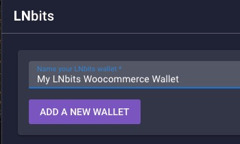
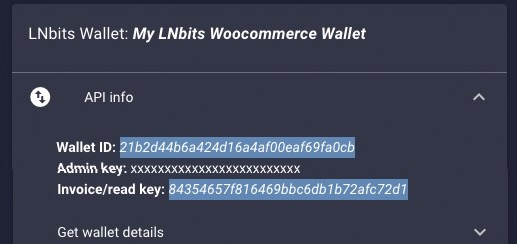
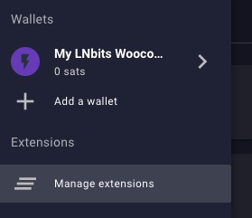
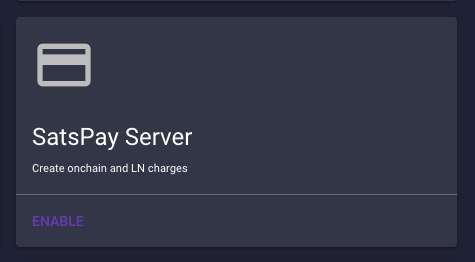
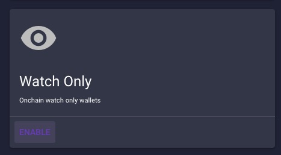
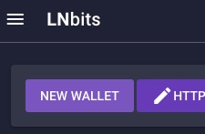
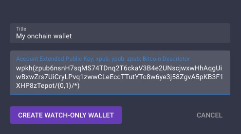
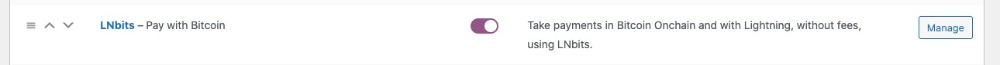
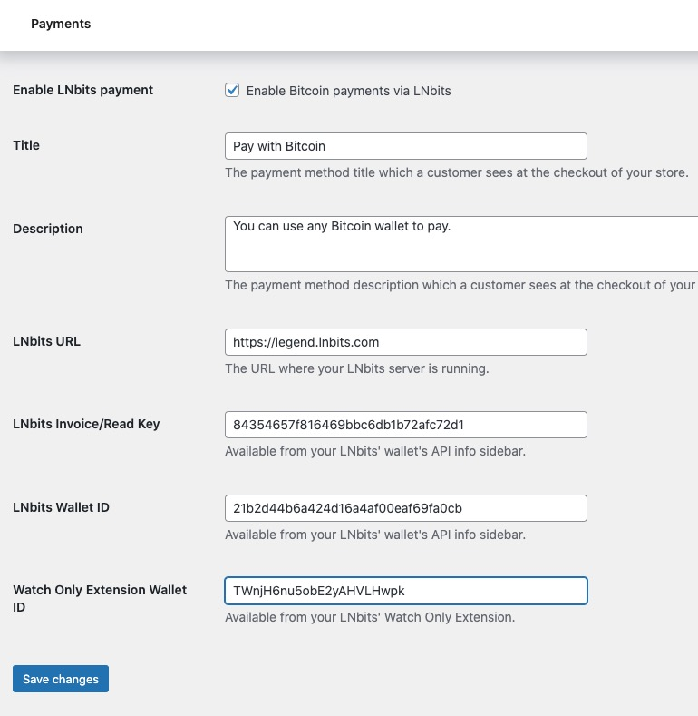

# LNbits - Bitcoin Lightning and Onchain Payment Gateway

## Introduction

This WooCommerce extensions lets you accept onchain and lightning Bitcoin payments
using the LNbits Satspay Server extension.

Follow the instructions at https://github.com/lnbits/woocommerce-payment-gateway/blob/main/README.md to configure 
and setup the plugin.

You will need access to an LNbits instance to use this plugin. You can use the _demo_ LNbits
instance at https://demo.lnbits.com/ to _test_ this plugin.

## License
This plugin is released under the [MIT license](https://github.com/lnbits/woocommerce-payment-gateway/blob/main/LICENSE).

## Installation

### LNbits configuration
1. Open your LNbits instance e.g. https://demo.lnbits.com/

1. Create a new wallet, or use an existing wallet if you already have one you want to use

   
1. From the sidebar, take a note of the Wallet ID and Invoice/read key. You will need this later

   

1. Click manage extensions in the sidemenu and enable the Satspay Server and Watch Only extensions
   
   

   

   

1. Open the Watch Only extension and import an xpub/ypub/zpub to add a new watch only wallet

   

1. Take a note of the watch only wallet ID that has been created. You will need this later

   

1. That's it. Now, let's set up the WooCommerce plugin!

### WooCommerce Plugin Setup

1. Install the plugin using your Wordpress admin panel by searching for "LNbits - Bitcoin Lightning and Onchain
   Payment Gateway" or drop this repo into your wp-content/plugins directory

1. Activate the plugin

1. Open _WooCommerce > Settings > Payments_ and activate the LNbits payment method, then click _manage_.

   

1. Edit the Title and Description fields as you want

1. Enter the LNbits URL for your LNbits server and paste in your settings for the Invoice/Read Key, Wallet ID and Watch Only Extension Wallet ID

   

1. Click "Save changes"

## Development

To build the blocks integration:

1. Install dependencies:
```bash
npm install
```

2. Build the assets:
```bash
npm run build
```

For development, you can use:
```bash
npm run start
```
```

The key changes in this update are:

1. Added support for WooCommerce Blocks API through a new `LNbitsPaymentMethod` class
2. Created a React component for the checkout block interface
3. Set up the necessary build process for JavaScript assets
4. Maintained compatibility with the existing classic checkout while adding support for the new blocks checkout

To implement this update:

1. Create the directory structure:
```bash
mkdir -p blocks/src blocks/build
```

2. Create all the files mentioned above
3. Install the Node.js dependencies
4. Build the JavaScript assets
5. Test the integration in both classic and block-based checkout pages

The updated plugin will now work with both:
- Classic WooCommerce checkout
- New WooCommerce Blocks checkout

The payment flow remains the same, but the integration is now compatible with the modern block-based checkout experience. The plugin will continue to:
1. Create a SatsPay charge when an order is placed
2. Redirect to the LNbits payment page
3. Handle payment confirmation through webhooks

### Acknowledgements
This plugin is a fork of Phaedrus' original [LNBits For WooCommerce](https://gitlab.com/sovereign-individuals/lnbits-for-woocommerce).

Thank you to Phaedrus for the work on the original plugin on which this plugin leans heavily.
